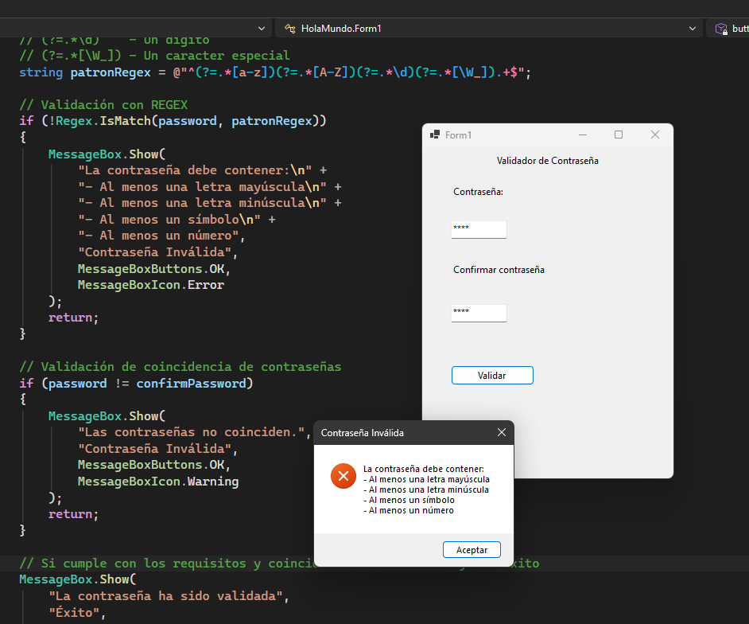
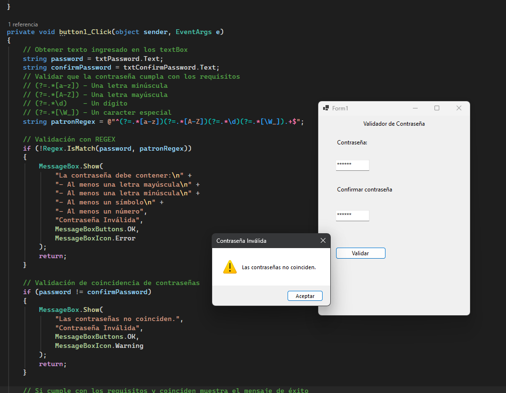

# HolaMundo
# Práctica Warm up: Validación de Contraseñas con WinForms (.NET 8)

**Materia:** Ciberinfraestructura  
**Docente:** Ma. Inés Calderón Zetter  
**Alumno:** Irving Eduardo Torrico Olivares 
**Proyecto:** HolaMundo

## Descripción del Proyecto
Aplicación de escritorio desarrollada en C# WinForms sobre .NET 8 que realiza la validación de estructura y coincidencia de contraseñas utilizando Expresiones Regulares (Regex) en el lado del cliente.

### Reglas de Validación de Contraseña
1. Al menos una letra mayúscula.
2. Al menos una letra minúscula.
3. Al menos un número.
4. Al menos un carácter especial.
5. Coincidencia exacta entre el campo de contraseña y confirmación.

---

## Evidencias de Funcionamiento

### Escenario 1: Error de Validación por Regex (Estructura)
Se ingresó la contraseña `Hola` en ambos campos. Al no cumplir con la exigencia de contener al menos un número y un símbolo, el sistema desplegó la ventana emergente con el error de validación.



---

### Escenario 2: Error de Coincidencia (Contraseñas Diferentes)
Se ingresó `Hola1!` en el primer campo y `Hola2!` en el campo de confirmación. Aunque ambas contraseñas cumplen individualmente con la regla de complejidad, al no ser idénticas el sistema desplegó la advertencia correspondiente.



---

### Escenario 3: Validación Exitosa
Se ingresó la contraseña `Hola1!` en ambos campos. Al cumplir con todos los criterios de complejidad (mayúscula, minúscula, número y símbolo) y coincidir ambos campos, se desplegó el mensaje requerido: *"La contraseña ha sido validada"*.


```csharp
using System;
using System.Text.RegularExpressions;
using System.Windows.Forms;

namespace HolaMundo
{
    public partial class Form1 : Form
    {
        public Form1()
        {
            InitializeComponent();
        }

        /// <summary>
        /// Evento Click del botón que ejecuta la validación de contraseña mediante Regex.
        /// </summary>
        private void button1_Click(object sender, EventArgs e)
        {
            string password = txtPassword.Text;
            string confirmPassword = txtConfirmPassword.Text;

            // Patrón Regex: Exige Mayúscula, Minúscula, Número y Símbolo
            string patronRegex = @"^(?=.*[a-z])(?=.*[A-Z])(?=.*\d)(?=.*[\W_]).+$";

            // 1. Validar la estructura de la contraseña
            if (!Regex.IsMatch(password, patronRegex))
            {
                MessageBox.Show(
                    "La contraseña debe exigir:\n" +
                    "- Al menos una letra mayúscula\n" +
                    "- Al menos una letra minúscula\n" +
                    "- Al menos un símbolo\n" +
                    "- Al menos un número",
                    "Error de Validación",
                    MessageBoxButtons.OK,
                    MessageBoxIcon.Error
                );
                return;
            }

            // 2. Validar coincidencia de campos
            if (password != confirmPassword)
            {
                MessageBox.Show(
                    "Las contraseñas no coinciden.",
                    "Error de Coincidencia",
                    MessageBoxButtons.OK,
                    MessageBoxIcon.Warning
                );
                return;
            }

            // 3. Confirmación exitosa
            MessageBox.Show(
                "La contraseña ha sido validada",
                "Éxito",
                MessageBoxButtons.OK,
                MessageBoxIcon.Information
            );
        }
    }
}
